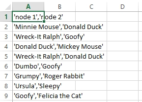
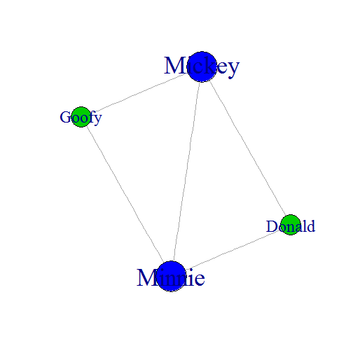

Graph Explorer
========================================================
author: Mark Stam
date: Sat Aug 16 16:34:53 2014
transition:rotate
font-family: 'Trebuchet MS'

A web application running on __Shiny server__

Social Network Analysis
========================================================
Social network analysis (SNA) is the use of network theory to analyse social networks. Social network analysis views social relationships in terms of network theory, consisting of nodes, representing individual actors within the network. These networks are often depicted in a Graph, where __nodes__ (or _vertices_) are represented as points and __edges__ are represented as lines.

__Graph explorer__, a web application running on __Shiny server__, takes a CSV file with nodes as input. The output is a visual analysis of connections and degrees. All you need is RStudio and the __shiny__ and __igraph libraries__.
Example
========================================================

 

example csv file and Graph output

Graph information
========================================================
Graph explorer will show some important details about the network,
like who's connected to who and which nodes have an higher degree than other nodes. 

```
       Donald Goofy Minnie Mickey
Donald      0     0      1      1
Goofy       0     0      1      1
Minnie      1     1      0      1
Mickey      1     1      1      0
```

```
       degree rank
Minnie           3
Mickey           3
Donald           2
Goofy            2
```
Download
========================================================

Download Graph Explorer at:

- https://github.com/digistam/ShinyProject/tree/master/GraphExplorer

Graph Explorer has been built during the ___Developing Data Products___ course of ___Johns Hopkins University___ on Coursera.

Mark Stam, Sat Aug 16 16:34:55 2014
